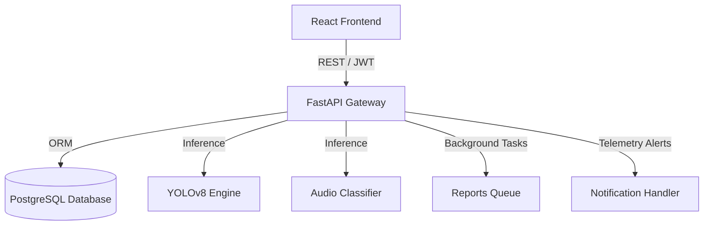

# System Architecture & Database Schema

Detailed description of the WPIS micro-services architecture and database entity relations.

---

## 🏗️ Architecture Design

- **Inference Pipeline**: Camera trap uploads trigger the YOLOv8 service layer, and audio files trigger the BirdNET Librosa analysis layer. Predictions are written directly to the `observations` database table.
- **Reporting Engine**: Exports are processed asynchronously via FastAPI's `BackgroundTasks`, logging state updates in `ReportHistory` to ensure non-blocking UI operations.

---

## 🗄️ Entity-Relationship Schema

The database model normalized structure includes:
- **Users / Roles**: RBAC mapping with custom credentials and OAuth linkages.
- **Monitoring Sites**: Geospatial reference coordinates and protected reserve indicators.
- **Surveys**: Connected to monitoring sites, listing device types and active dates.
- **Observations**: Sighted species, GPS coordinates, timestamps, and confidence scores.
- **Notifications**: System warnings linked to sites and species.
- **ReportHistory**: Tracked generation logs of compiled analytics documents.
