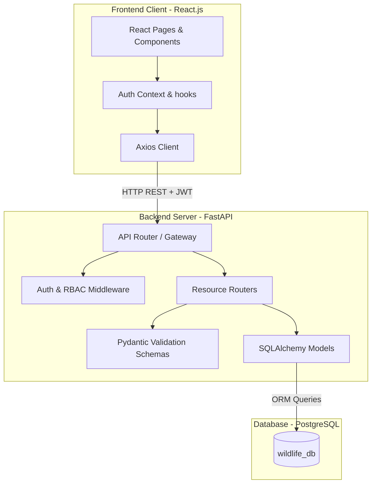
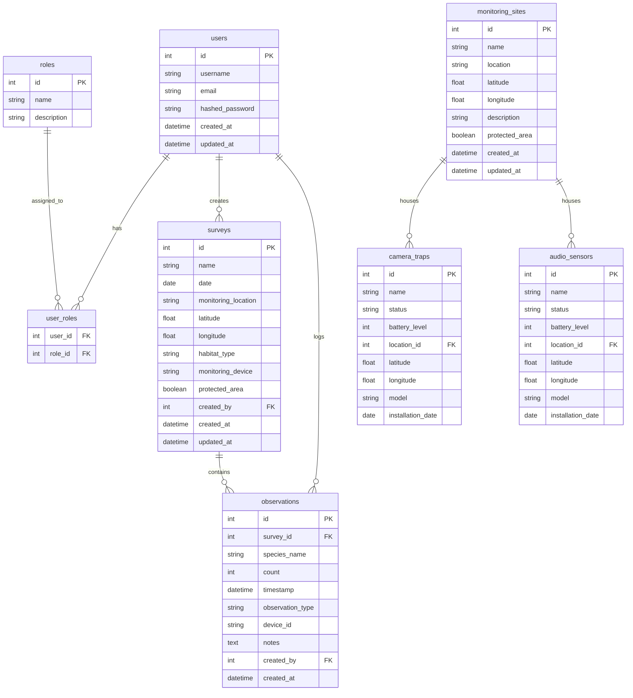

# Wildlife Population Intelligence System - Architecture & ERD (Milestone 1)

This document contains visual diagrams for the platform's architecture and database relationships.

## 1. System Architecture Diagram

## 2. Database ER Diagram

The database schema is fully normalized and enforces foreign keys for user ownership and device installations.

